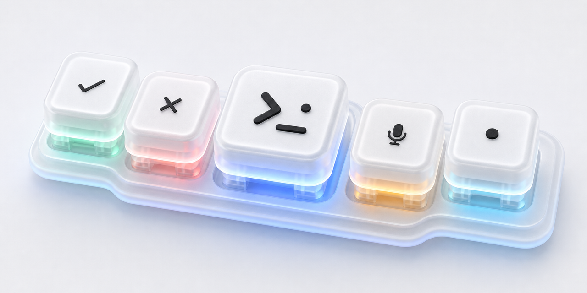
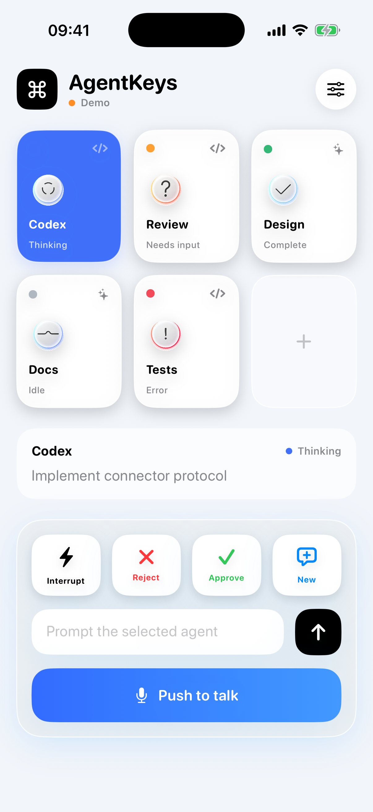

<p align="center"></p>

# AgentKeys

An open-source, tactile iPhone control surface for coding agents.

AgentKeys turns the phone already on your desk into a compact agent console: see which tasks are idle, thinking, complete, waiting for input, or failing; select an agent; send a prompt; and issue explicit approve, reject, interrupt, and new-chat actions.

<p align="center"></p>

> [!IMPORTANT]
> AgentKeys is an independent community project. It is not affiliated with or endorsed by OpenAI, Anthropic, Work Louder, Herdr, or Tailscale. “Codex” and other product names belong to their respective owners.

## What works today

- Native SwiftUI control deck for iPhone and iPad, with tactile animation, haptics, and five transparent single-element status assets.
- Live status polling through the local companion protocol.
- Semantic action queue: `approve`, `reject`, `interrupt`, `new_chat`, and `prompt`.
- Push-to-talk speech transcription using Apple Speech APIs.
- Interactive offline demo, so the app is useful before pairing.
- Dependency-free Node companion with separate phone and harness credentials.
- Harness-facing endpoints for registering agents and retrieving queued actions.

The repository does **not** yet claim automatic Codex or Claude Code approval integration. Those adapters must translate each harness's verified lifecycle events and permission model into the documented protocol. Unknown actions are rejected rather than converted into guessed keystrokes.

### Dictation baseline

Dictation currently uses Apple's native Speech framework: your iPhone acts as the microphone, partial transcription appears directly in the prompt field, and no AgentKeys speech backend is required. This is the baseline we will test before considering a WhisprFlow-like streaming pipeline. See [the voice evaluation plan](docs/voice-pipeline.md).

## Quick start

Requirements: macOS, Xcode 26+, iOS 17+, Node.js 20+, and [XcodeGen](https://github.com/yonaskolb/XcodeGen).

```sh
git clone https://github.com/metaforismo/AgentKeys.git
cd AgentKeys
xcodegen generate
open AgentKeys.xcodeproj
```

The app opens in interactive demo mode. To use the live companion:

```sh
cd connector
npm test
AGENTKEYS_PHONE_TOKEN='replace-with-a-long-random-token' \
AGENTKEYS_INTEGRATION_TOKEN='replace-with-a-different-long-random-token' \
node src/cli.mjs --demo
```

The default companion listens on loopback only. For an iPhone on Tailscale, bind to the Mac's Tailscale IP and opt in explicitly:

```sh
node src/cli.mjs --host 100.x.y.z --allow-network
```

Enter the transport, host, port, and printed phone token in AgentKeys settings. Use **Local HTTP** only for loopback or a private Tailscale connection; select **HTTPS** when the companion is behind a TLS endpoint. Never expose port `7777` directly to the public internet.

## Architecture

```text
┌──────────────────────┐   authenticated HTTP(S)      ┌──────────────────────┐
│ AgentKeys iOS        │ ────────────────────────────► │ Local Mac companion  │
│ status + commands    │ ◄──────────────────────────── │ semantic queue only  │
└──────────────────────┘                               └──────────┬───────────┘
                                                                  │ adapter API
                                                       ┌──────────▼───────────┐
                                                       │ Harness adapter      │
                                                       │ Codex / Claude / ... │
                                                       └──────────────────────┘
```

The iOS app never sends shell text. It sends a small, typed action vocabulary. A harness adapter decides whether an action is supported and how it maps into the harness. See [the protocol](docs/protocol.md) and [security model](SECURITY.md).

## Project status

AgentKeys is an early foundation release. The control surface and companion protocol are functional; production harness adapters, Bonjour pairing, encrypted local transport outside Tailscale, and background notifications are next. See [the roadmap](ROADMAP.md).

## Inspiration

The project was inspired by the tactile multi-agent ideas behind Codex Micro, community iOS experiments built around Herdr, and [stephenleo/OpenMicro](https://github.com/stephenleo/OpenMicro). OpenMicro focuses on physical game controllers and terminal harnesses; AgentKeys focuses on a phone-native UI and a deliberately small interoperability protocol.

## Contributing

Issues and pull requests are welcome. Start with [CONTRIBUTING.md](CONTRIBUTING.md). Please do not submit an adapter that guesses approval state or executes arbitrary commands from the phone.

## License

MIT License. See [LICENSE](LICENSE).

The original generated visual assets are documented in [assets/GENERATED_ASSETS.md](assets/GENERATED_ASSETS.md).
