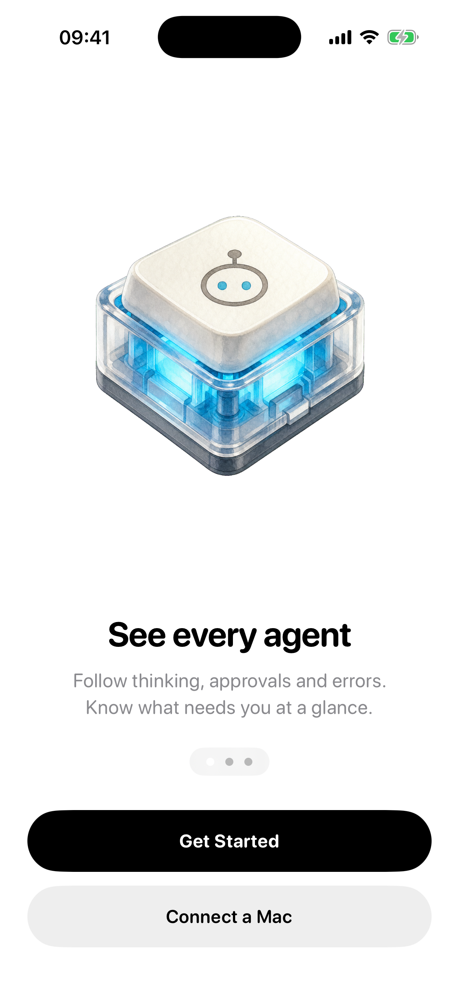

# AgentKeys

<p align="center">
  <strong>An open-source, tactile iPhone control surface for coding agents.</strong>
</p>

<p align="center">
  <a href="https://github.com/metaforismo/AgentKeys/actions/workflows/ci.yml"></a>
  
  
  <a href="LICENSE"></a>
</p>

<p align="center">
  <a href="assets/agentkeys-onboarding.png"></a>
  &nbsp;&nbsp;
  <a href="assets/agentkeys-simulator.png"></a>
</p>

<p align="center"><sub>First-run onboarding and the actual control deck, captured from the AgentKeys build on an iPhone 17 Pro simulator.</sub></p>

AgentKeys turns the phone already on your desk into a compact console for agent work. See which tasks are active, waiting, complete, or failing; select an agent; dictate or type a prompt; and operate a provider-aware control deck for approvals, workflows, modes, effort, speed, and isolated branches.

> [!IMPORTANT]
> AgentKeys is an independent community project. It is not affiliated with or endorsed by OpenAI, Anthropic, Work Louder, or Tailscale. Product names belong to their respective owners.

## What works today

- Native SwiftUI control deck for iPhone and iPad.
- Three-page first-run introduction with instant demo and Mac-connector paths.
- Five visually distinct agent states: `idle`, `thinking`, `complete`, `needs_input`, and `error`.
- Live status polling through a small, documented local protocol.
- Semantic action queue: `approve`, `reject`, `interrupt`, `new_chat`, and `prompt`.
- Capability-driven Codex and Claude Code profiles with provider-specific modes.
- Tactile workflow pad for PR review, debugging, refactoring, and focused tests.
- Reasoning-effort dial, Codex fast/standard control, and safe branch/worktree requests.
- Push-to-talk transcription using Apple's Speech framework.
- Interactive offline demo with tactile animation and haptics.
- Dependency-free Node.js companion with separate phone and adapter credentials.
- Adapter-facing endpoints for registering agents and retrieving queued actions.

The repository does **not** claim automatic Codex or Claude Code approval integration yet. An adapter must translate verified lifecycle events and preserve each coding harness's native permission model. Unknown or unadvertised actions are rejected instead of becoming guessed keystrokes or arbitrary shell commands. Claude Code permission bypass is intentionally not part of the protocol.

## How it works

```text
┌──────────────────────┐   authenticated HTTP(S)      ┌──────────────────────┐
│ AgentKeys for iOS    │ ────────────────────────────► │ Local Mac companion  │
│ status + commands    │ ◄──────────────────────────── │ semantic queue only  │
└──────────────────────┘                               └──────────┬───────────┘
                                                                  │ adapter API
                                                       ┌──────────▼───────────┐
                                                       │ Coding-agent adapter │
                                                       │ Codex / Claude / ... │
                                                       └──────────────────────┘
```

The iOS app never submits shell text for execution. It sends a typed action vocabulary to the companion. A local adapter decides which actions its coding harness supports and how they map to that harness.

Each agent advertises a capability profile. Codex sessions can expose plan mode, supported reasoning levels, fast mode, and isolated branch workflows. Claude Code sessions can expose its safe permission modes, model-supported effort levels, worktrees, and agent workflows. The UI changes per agent instead of assuming the two harnesses are identical.

The control vocabulary follows current first-party surfaces: [Codex Micro](https://openai.com/supply/co-lab/work-louder/) pairs agent state keys with workflow shortcuts and live reasoning control, while the [Claude Code CLI reference](https://code.claude.com/docs/en/cli-reference) documents worktrees, agent monitoring, effort, model, resume, and permission-mode controls. AgentKeys adopts the useful interaction ideas without claiming undocumented integration.

Read the [protocol](docs/protocol.md) and [security model](SECURITY.md) before building an adapter.

## Run the iOS app

Requirements:

- macOS with Xcode 26 or newer
- iOS 17 or newer
- [XcodeGen](https://github.com/yonaskolb/XcodeGen)

```sh
git clone https://github.com/metaforismo/AgentKeys.git
cd AgentKeys
xcodegen generate
open AgentKeys.xcodeproj
```

Build and run the `AgentKeys` scheme. The first-run introduction offers an instant interactive demo, so no connector or credentials are required to explore the interface. Choose **Connect a Mac** only when you are ready to pair the local companion; the introduction can be replayed from Connector settings.

## Run the Mac companion

The reference companion requires Node.js 20 or newer and has no runtime dependencies.

```sh
cd connector
npm test
AGENTKEYS_PHONE_TOKEN='replace-with-a-long-random-token' \
AGENTKEYS_INTEGRATION_TOKEN='replace-with-a-different-long-random-token' \
node src/cli.mjs --demo
```

It listens on loopback by default. To connect an iPhone through a private Tailscale network, bind to the Mac's Tailscale address explicitly:

```sh
node src/cli.mjs --host 100.x.y.z --allow-network
```

Enter the transport, host, port, and printed phone token in AgentKeys settings. Use **Local HTTP** only for loopback or a private encrypted tunnel. Select **HTTPS** when the companion is behind a TLS endpoint. Never expose port `7777` directly to the public internet.

## Voice input

Dictation currently uses Apple's native Speech framework. The iPhone acts as the microphone, and partial transcription appears directly in the selected agent's prompt field without an AgentKeys speech backend.

This is the measured baseline. A streaming transcription service should replace it only if controlled tests show meaningfully better technical-token accuracy or latency. See the [voice evaluation plan](docs/voice-pipeline.md).

## Design

<p align="center"></p>

The interface borrows the satisfying clarity of a physical macro pad while remaining a phone-native tool. The first-run flow teaches monitoring, command, and provider switching before revealing the denser control deck. Agent status is communicated through icon, text, and color so the meaning does not depend on color alone.

Generated visual assets and their reproducible processing steps are documented in [assets/GENERATED_ASSETS.md](assets/GENERATED_ASSETS.md).

## Project status

AgentKeys is an early foundation release. The iOS control surface, capability protocol, local companion, provider-aware demo, voice input, and CI are functional. Production coding-agent adapters, secure pairing, durable history, and background notifications remain on the [roadmap](ROADMAP.md).

## Contributing

Issues and pull requests are welcome. Start with [CONTRIBUTING.md](CONTRIBUTING.md), use the repository templates, and include reproducible evidence for adapter compatibility claims.

Please do not submit an adapter that guesses permission state, bypasses a harness confirmation boundary, or executes arbitrary commands received from the phone.

## Security

Read [SECURITY.md](SECURITY.md) for the trust model and private reporting instructions. The iPhone is deliberately treated as a semantic remote control—not a remote shell.

## Inspiration

AgentKeys was inspired by tactile multi-agent controls such as [Codex Micro](https://openai.com/supply/co-lab/work-louder/) and the open-source controller experiments in [stephenleo/OpenMicro](https://github.com/stephenleo/OpenMicro). AgentKeys explores the same interaction idea as a phone-native, agent-agnostic interface.

## License

AgentKeys is available under the [MIT License](LICENSE).
