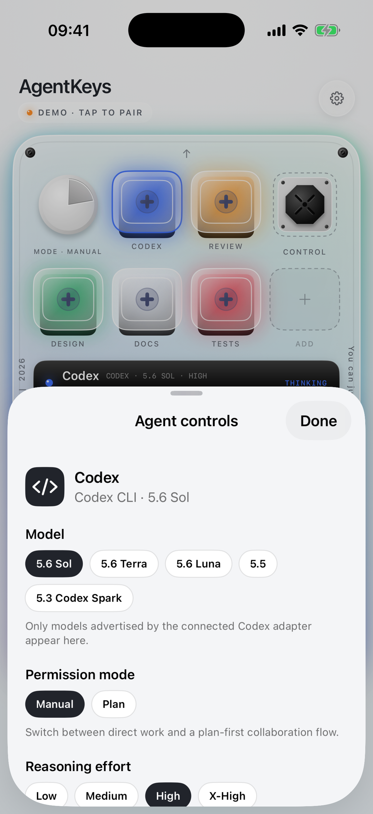
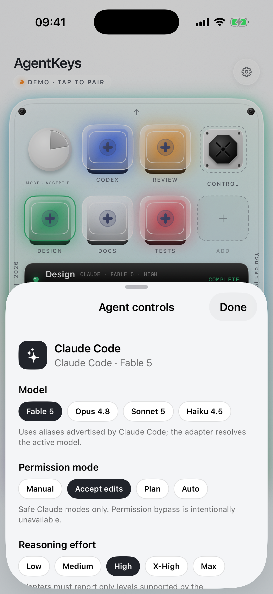
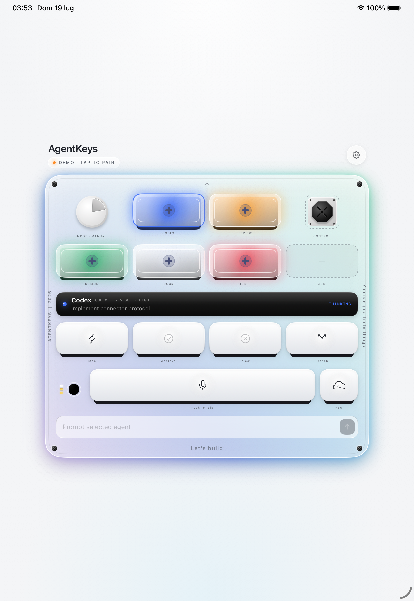

# AgentKeys

<p align="center">
  <strong>An open-source, tactile iPhone control surface for coding agents.</strong>
</p>

<p align="center">
  <a href="https://github.com/metaforismo/AgentKeys/actions/workflows/ci.yml"></a>
  
  
  <a href="LICENSE"></a>
</p>

<p align="center">
  <a href="assets/agentkeys-onboarding.png"></a>
  &nbsp;&nbsp;
  <a href="assets/agentkeys-simulator.png"></a>
</p>

<p align="center"><sub>First-run onboarding and the actual control deck, captured from the AgentKeys build on an iPhone 17 Pro simulator.</sub></p>

AgentKeys turns the phone already on your desk into a compact console for agent work. See which tasks are active, waiting, complete, or failing; select an agent; dictate or type a prompt; and operate a provider-aware control deck for approvals, workflows, modes, models, effort, speed, sessions, search, and isolated branches.

> [!IMPORTANT]
> AgentKeys is an independent community project. It is not affiliated with or endorsed by OpenAI, Anthropic, Work Louder, or Tailscale. Product names belong to their respective owners.

## What works today

- Native SwiftUI control deck for iPhone and iPad.
- Three-page first-run introduction with instant demo and Mac-connector paths.
- Five visually distinct agent states: `idle`, `thinking`, `complete`, `needs_input`, and `error`.
- Live status polling through a small, documented local protocol.
- One-scan pairing: the companion prints an `agentkeys://` QR code, the app stores the token in the Keychain and reconnects automatically.
- Semantic action queue: `approve`, `reject`, `interrupt`, `new_chat`, and `prompt`.
- Capability-driven Codex and Claude Code profiles with provider-specific modes.
- Tactile workflow pad for PR review, debugging, refactoring, and focused tests.
- Reasoning-effort dial, Codex fast/standard control, and safe branch/worktree requests.
- Provider-advertised model selection, Codex live-search control, and resume/fork session actions behind the rotary dial.
- Push-to-talk transcription using Apple's Speech framework.
- Interactive offline demo with tactile animation and haptics.
- Small Node.js companion with separate phone and adapter credentials; the Claude adapter uses Anthropic's official Agent SDK.
- Adapter-facing endpoints for registering agents and retrieving queued actions.
- Experimental Codex app-server adapter with verified lifecycle, approval, interrupt, model, effort, fast-tier, resume, and fork mappings.
- Experimental Claude Agent SDK adapter with persistent prompts, exact tool approvals, interrupt, model, effort, fast mode, permission modes, resume, and fork.

<p align="center">
  <a href="assets/agentkeys-controls.png"></a>
  &nbsp;&nbsp;
  <a href="assets/agentkeys-claude-controls.png"></a>
</p>

<p align="center"><sub>Provider-specific controls stay behind the rotary dial, keeping the main deck focused while Codex and Claude Code expose their own live capabilities.</sub></p>

The repository includes real, experimental adapters for **Codex app-server** and the **Claude Agent SDK**. Both translate structured lifecycle events and exact pending approvals; neither scrapes terminal text, injects keystrokes, or synthesizes approval state. Unsupported requests fail closed, and Claude Code permission bypass is intentionally outside the protocol.

## How it works

```text
┌──────────────────────┐   authenticated HTTP(S)      ┌──────────────────────┐
│ AgentKeys for iOS    │ ────────────────────────────► │ Local Mac companion  │
│ status + commands    │ ◄──────────────────────────── │ semantic queue only  │
└──────────────────────┘                               └──────────┬───────────┘
                                                                  │ adapter API
                                                       ┌──────────▼───────────┐
                                                       │ Coding-agent adapter │
                                                       │ Codex / Claude / ... │
                                                       └──────────────────────┘
```

The iOS app never submits shell text for execution. It sends a typed action vocabulary to the companion. A local adapter decides which actions its coding harness supports and how they map to that harness.

Each agent advertises a capability profile. The current Codex adapter exposes supported models and reasoning levels, fast mode, resume, and fork. The current Claude adapter exposes its safe permission modes, live model catalog, model-supported effort levels and fast mode, resume/fork, and agent workflows. Branches, worktrees, and search stay hidden until an adapter can execute and verify them. The UI changes per agent instead of assuming the two harnesses are identical.

The control vocabulary follows current first-party surfaces: [Codex Micro](https://openai.com/supply/co-lab/work-louder/) pairs agent state keys with workflow shortcuts and live reasoning control; the [Codex CLI reference](https://developers.openai.com/codex/cli/reference/) documents model, search, resume, and fork controls; and the [Claude Code CLI reference](https://code.claude.com/docs/en/cli-reference) documents worktrees, agent monitoring, effort, model, continue/resume, fork, and permission-mode controls. AgentKeys adopts the useful interaction ideas without claiming undocumented integration.

Read the [protocol](docs/protocol.md) and [security model](SECURITY.md) before building an adapter.

## Run the iOS app

Requirements:

- macOS with Xcode 26 or newer
- iOS 17 or newer
- [XcodeGen](https://github.com/yonaskolb/XcodeGen)

```sh
git clone https://github.com/metaforismo/AgentKeys.git
cd AgentKeys
xcodegen generate
open AgentKeys.xcodeproj
```

Build and run the `AgentKeys` scheme. The first-run introduction offers an instant interactive demo, so no connector or credentials are required to explore the interface. Choose **Connect a Mac** only when you are ready to pair the local companion; the introduction can be replayed from Connector settings.

## Run the Mac companion

The reference companion requires Node.js 20 or newer. Install the locked dependency set before running it:

```sh
cd connector
npm ci
npm test
node src/cli.mjs --demo
```

Tokens are generated on first run and persisted with `0600` permissions in `~/.agentkeys/credentials.json`, so restarting the companion never breaks an existing pairing. Set `AGENTKEYS_PHONE_TOKEN` and `AGENTKEYS_INTEGRATION_TOKEN` to override them.

The companion listens on loopback by default. To connect an iPhone through a private Tailscale network, bind to the Mac's Tailscale address explicitly:

```sh
node src/cli.mjs --host 100.x.y.z --allow-network
```

When reachable beyond loopback it prints an `agentkeys://pair` link and a QR code. Pair the phone by scanning the QR from **AgentKeys → settings → Scan pairing QR** (or by opening the link on the phone); the pairing is stored in the iOS Keychain and reconnects automatically on the next launch. Manual entry of transport, host, port, and token remains available. Use **Local HTTP** only for loopback or a private encrypted tunnel. Select **HTTPS** when the companion is behind a TLS endpoint. Never expose port `7777` directly to the public internet.

## Connect Codex

With the companion running, open a second terminal on the same machine — the adapter reads the integration token from `~/.agentkeys/credentials.json` automatically:

```sh
cd connector
npm run start:codex -- --workspace /absolute/path/to/project
```

For an adapter on a different machine, export `AGENTKEYS_INTEGRATION_TOKEN`; the companion reveals the secret only via the explicit `node src/cli.mjs --show-integration-token` command, never in its startup logs.

The adapter starts or resumes a real Codex thread, publishes only the controls supported by the active model catalog, and maps Codex lifecycle notifications to the five AgentKeys states. It creates new threads with `workspace-write` sandboxing and `on-request` approvals. Structured request types that the phone cannot represent are rejected and must be continued on the Mac.

Because `codex app-server` is experimental, run `npm run smoke:codex` after upgrading Codex. The smoke test initializes the local server and reads its model catalog without starting a model turn. See the [Codex adapter guide](docs/codex-adapter.md) for options, supported actions, and compatibility limits.

## Connect Claude Code

With the companion running, open a second terminal on the same machine — the adapter reads the integration token automatically:

```sh
cd connector
npm run start:claude -- --workspace /absolute/path/to/project
```

The adapter uses Anthropic's official persistent Agent SDK query rather than terminal text. Claude's own `canUseTool` callback pauses the exact tool request until **Approve** or **Reject** resolves it. `bypassPermissions` is never advertised or selected. Structured `AskUserQuestion` prompts currently stop with a clear “continue on the Mac” error because the phone protocol cannot faithfully return multiple structured answers yet.

Run `npm run smoke:claude` after upgrading the SDK or Claude Code. It initializes the SDK and reads the live model catalog without sending a prompt. See the [Claude adapter guide](docs/claude-adapter.md) for permission modes, options, compatibility evidence, and usage notes.

## Voice input

Dictation currently uses Apple's native Speech framework. The iPhone acts as the microphone, and partial transcription appears directly in the selected agent's prompt field without an AgentKeys speech backend.

This is the measured baseline. A streaming transcription service should replace it only if controlled tests show meaningfully better technical-token accuracy or latency. See the [voice evaluation plan](docs/voice-pipeline.md).

## Design

<p align="center"></p>

The interface borrows the satisfying clarity of a physical macro pad while remaining a phone-native tool. The first-run flow teaches monitoring, command, and provider switching before revealing the denser control deck. Agent status is communicated through icon, text, and color so the meaning does not depend on color alone.

<p align="center">
  <a href="assets/agentkeys-ipad.png"></a>
</p>

<p align="center"><sub>On iPad, the control surface keeps its physical proportions and sits centered like a dedicated console instead of stretching into a dashboard.</sub></p>

Generated visual assets and their reproducible processing steps are documented in [assets/GENERATED_ASSETS.md](assets/GENERATED_ASSETS.md).

## Project status

AgentKeys is an early foundation release. The iOS control surface, capability protocol, local companion, provider-aware demo, voice input, experimental Codex and Claude adapters, and CI are functional. Stable adapter compatibility, secure pairing, durable history, and background notifications remain on the [roadmap](ROADMAP.md).

## Contributing

Issues and pull requests are welcome. Start with [CONTRIBUTING.md](CONTRIBUTING.md), use the repository templates, and include reproducible evidence for adapter compatibility claims.

Please do not submit an adapter that guesses permission state, bypasses a harness confirmation boundary, or executes arbitrary commands received from the phone.

## Security

Read [SECURITY.md](SECURITY.md) for the trust model and private reporting instructions. The iPhone is deliberately treated as a semantic remote control—not a remote shell.

## Inspiration

AgentKeys was inspired by tactile multi-agent controls such as [Codex Micro](https://openai.com/supply/co-lab/work-louder/) and the open-source controller experiments in [stephenleo/OpenMicro](https://github.com/stephenleo/OpenMicro). AgentKeys explores the same interaction idea as a phone-native, agent-agnostic interface.

## License

AgentKeys is available under the [MIT License](LICENSE).
